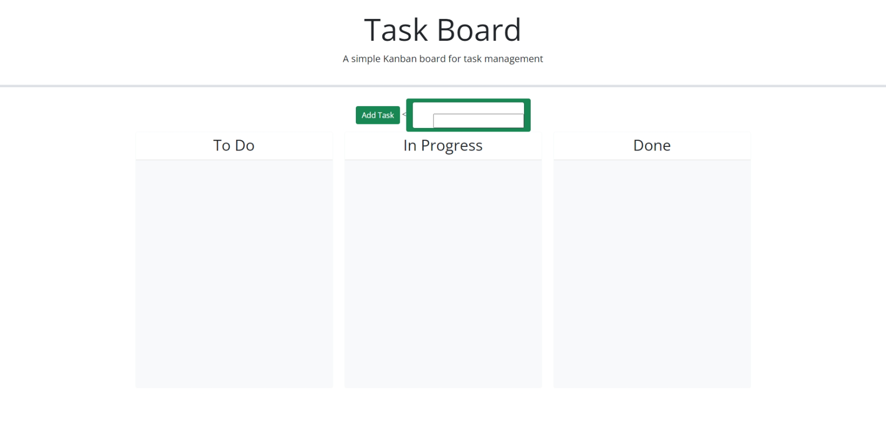

# Daily-schedule

## Description

The webpage was created to demostrate the fuctionality of adding tasks to the webpage and being able to drag them from column to column. The background coding of the webpage involves the html button fuctionality and as well as the javascript. The webpage is a great way to keep you up to date when it comes to important due dates involving homework and day which you have classes.

## Table of Contents

N/A

## Installation

My Url will be located in my GitHub account which will lead to my repository. As well as, the following link provided in hte usage section will lead to the webpage.

## Usage

## Credits

THank you to W3School for providing code that enable some of the fuctions that were implemanted to this webpage.

## License

License is provided my MIT License.

## Badges

N/A

## Features

N/A

## How to Contribute

N/A

## Test

N/A